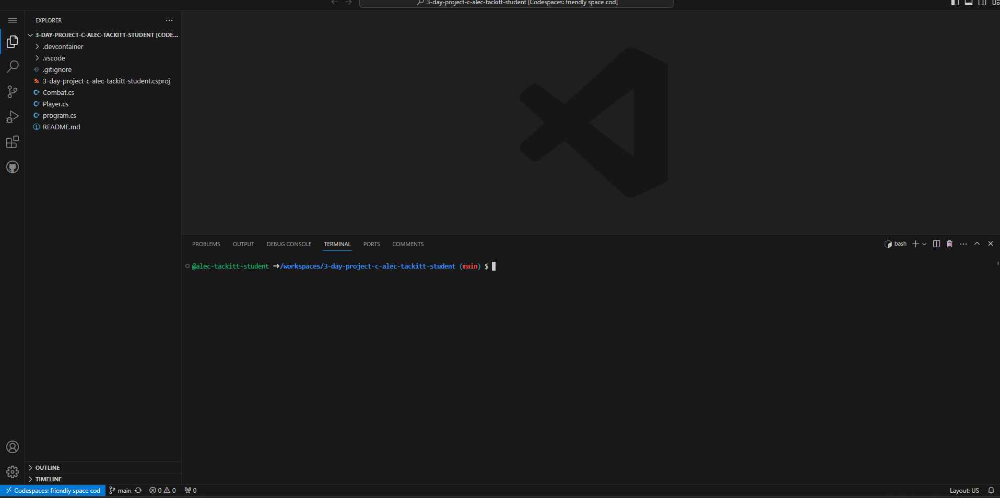
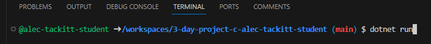

# Welcome!
#### This is the repository for a simple game to play with friends made by Max Baykowski, Keegan Ziemann-Bell, and Alec Tackitt
___
## Project background
we were tasked with making a simple game together to practice project management together. we decided to make a simple turn-based fighting game so two friends could battle for a winner.
___
## Instructions
To start playing the game, press the "open in codespaces" button below.  
  
next, if the terminal isn't open already, navigate to it by pressing `` crtl +` ``. now your screen should look something like this:

next run the `dotnet run` command like below, and hit `Enter`
  
after this you will be propmted to enter names for both players.  
(insert image here)  
now you are put right into the game to have fun! remember there is a cooldown on blocking and each player has limited heals!
